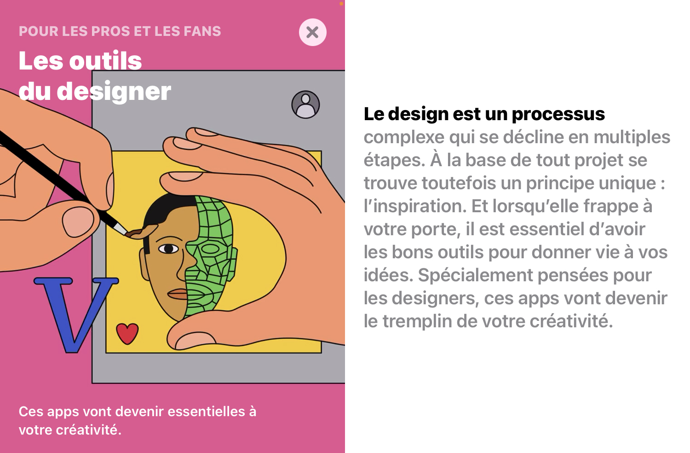

## &#36;recherche &#61; file&#95;get&#95;contents&#40;&#39;textes.md&#39;&#41;

### 
<a href="../index.php">accueil-home</a>

 

### Rendu numéro 02 - Mars 2022 - Workshop écriture

C'est par l'intermédiaire de logiciels gratuits comme peuvent l'être Gimp, Photofiltre, Inkscape ou encore Paint, que j'ai pu réaliser mes premières expériences de conception graphique.
J'ai commencé le graphisme par ordinateur vers l'âge de 10-11 ans, je dessinais des robes sur des modèles virtuels que je publiais sur le forum d'OhMyDollz. C'était en suivant les conseils avisé des multiples artistes du coin des artistes, que j'avais appris à utiliser les calques, à faire des ombrages, et à utiliser des brushs.

###### https://www.ohmydollz.com/ Archives disponibles sur https://web.archive.org/web/20081019011228/http://www.ohmydollz.com/forum/viewtopic.php?pid=369985#p369985

C’est donc évidemment très tôt que s’est manifesté mon désir d'utiliser Photoshop, l'un des logiciels de la suite Adobe les plus renommé du forum OhMyDollz.
Si toutes les meilleurs stylistes du forum l'utilisaient, c'est bien qu'il devait être exceptionnel, capable de transformer des dessins pas terribles en véritables œuvres d'art! J'ai obtenu un crack du logiciel dès que l'occasion s'est présenté, quelques années plus tard, et OhMyDollz était déjà loin derrière moi. Finalement, je ne sais pas si c'est Photoshop qui rendait mes dessins exceptionnels ou si c'était plutôt les tutoriels que je suivais méticuleusement sur YouTube.

> "Faites le premier pas avec Photoshop, la magie suivra. Laissez libre cours à votre créativité et créez des images d'exception, des éléments graphiques inédits et des œuvres d'art hors du commun. Oui, vous pouvez faire tout cela avec Photoshop. À partir de 23,99 € par mois."
###### Publicité sur la page web officielle du site Adobe https://www.adobe.com/fr/products/photoshop.html, dernière capture le 16 janvier 2022

J'avais déjà un coup d'avance lorsque j’ai commencé les cours de graphisme en première année de bac professionnel communication visuelle option pluri-médias. J'ai continué à accumuler du "savoir technique" en apprenant Illustrator et Indesign, deux autres logiciels emblématiques de la suite Adobe. D'après de nombreux appels d'offres, j'avais presque toutes les cartes en main, mis à part l'expérience, pour être une designeuse graphique professionnelle. La connaissance des logiciels est, en soi, une connaissance suffisante - même nécessaire - pour travailler. C'est valable pour de nombreux autres métiers: c'est le nombre de logiciels que vous maitrisez qui est déterminant pour l'embauche. Et aujourd'hui, les emplois qui échappent à l'utilisation de logiciels sont très peu nombreux.

Les logiciels, et plus généralement les outils numériques, font parti intégrante du paysage. Il est donc important de les analyser leurs impacts d’un point de vue esthétique, politique, social. C'est en parti ce que font les softwares studies[^1], un champ de recherche interdisciplinaire initié au début des années 2000 par Lev Manovich et Matthew Fuller, qui étudient les rapports des nouvelles technologies avec l’art et la culture.

Nous utilisons de nombreux logiciels - au sens large, algorithmes, programmes, applications - au quotidien, et nous ne questionnons même plus leur présence ou leur fonctionnement. Pour la plupart, nous les utilisons parce qu'ils sont des standards, qui se sont presque imposés à nous. 
Que se passe-t’il si l’on s’écarte de ces outils fait "pour" nous, et que nous commençons à concevoir ces outils fait "par" nous ?

[$programmation-interet.php](../programmation/programmation-interet.php)

> « L’ordinateur, bien sûr, n’est pas juste un outil de plus, pas plus qu’il n’est simplement la combinaison d’outils divers, sorte de couteau suisse numérique. L’ordinateur est plutôt un méta-outil: il produit d’autres outils. »
###### Outil (ou le designer graphique face à la post-production), Andrew Blauvelt, Traduit de l’américain par Véronique Rancurel (révision Samuel Vermeil), tiré di magazine «Tool (Or, Post-production for the Graphic Designer)», in Graphic Design: Now In Production, Cooper-Hewitt National Design Museum/ Walker Art Center, 2011. Disponible sur le site https://revue-azimuts.fr/numeros/47/outil-ou-le-designer-graphique-face-a-la-post-production

Anthony Masure rédige entre 2011 et 2015 plusieurs articles sur la suite Adobe et plus généralement sur les softwares studies, en se basant sur des écrits de Lev Manovich et Matthew Fuller ou encore de Pierre-Damien Huyghe. Dans son article sur Adobe, il expose les incidences destructrices du marketing et du productivisme sur la créativité. Comme on peut encore aisément le constater aujourd'hui, les publicités d'Adobe présentent leurs logiciels comme étant "magiques", "intelligents", "sans limites" (Adobe.com). Le logiciel donnerait le pouvoir au créateur, en lui offrant tous les outils nécessaires. Basée sur une logique de la selection, la firme se démarque et oriente sa publicité autour de l'accumulations de fonctions nouvelles, toujours plus "impressionnantes", "surprenantes", "fluides".
###### Publicité pour After Effect,https://www.adobe.com/fr/products/aftereffects.html

###### Article sur l'apple store "Les outils du designer", consulté et vu le 6 mars 2022.

> &#91;Les programmes Adobe&#93; "Ils organisent une « mise à disposition » de la créativité (Pierre-Damien Huyghe)", ils sont réactifs, ne bug pas, et il n'est pas necessaire d'écrire du code pour créer.
###### Anthony Masure, « Adobe : le créatif au pouvoir », Strabic.fr, « L’usager au pouvoir », juin 2011, https://www.anthonymasure.com/articles/2011-06-adobe-creatif-pouvoir

Dans son article, il explique à quel point la créativité est automatisée, que tout est fait pour que la création se passe sans accrocs, sans efforts. Même les sources d'inspirations sont cataloguées et uniformisées. On les retrouves dans des sites dédiés à l'inspiration, ou les images sont indexées et tagguées, pour organiser une sorte de consensus autour d'une même idée. L'objectif étant de toujours donner l'impression que la création est facile, "par la navigation sans effort parmi des galeries d’images lissées."

Ce nouveau pouvoir donné au créatif est représentatif d'une volonté de démocratiser la création ( favorisation du crack, marketing aggressif, peu d'alternative dans les écoles d'art...)
Adobe adapte et conçoit également de nouveaux produits en fonction de l'émergence de nouveaux métiers, Anthony Masure citait Adobe Cue en 2011 pour les chef de projets, et nous avons aujourd'hui Adobe XD qui est passé dans les must-have de la suite Adobe, suite à l'avènement des UX/UI designers.
Pour Anthony Masure, il y'aurait un rapprochement entre l'ouvrier prolétaire et l'assistant de création: tout deux sont dépendant de leurs outils/machines, qui font le travail à leur place de manière disciplinée et sans écarts. Les logiciels de la suite Adobe s'inscrivent dans une logique industrielle, et même si ils ne sont pas aussi limitatifs que peut l'être une machine industrielle, ils délimitent quand même un périmètre de création. De plus, rien n'indique chez Adobe une volonté "d'ouverture vers l'imprévu". Jurg Lheni, avec des projets comme Scriptographer, s'est bien rendu compte que les mises à jour incessantes rendaient impossible toute intervention extérieure. Comme Apple qui n'admet pas qu'un réparateur non agrégé répare leurs saint-appareils (https://www.arretsurimages.net/chroniques/clic-gauche/apple-et-lautoreparation-la-grande-illusion), Adobe ne met rien en œuvre pour qu'un autre programmeur interviennent dans ses systèmes.

>"Depuis CS3, j'ai régulièrement contacté Adobe pour lui proposer d'unir nos forces d'une manière ou d'une autre, car je pensais qu'ils devaient être intéressés par nos efforts. Malheureusement, ils ne semblaient pas l'être, ou n'avaient pas les ressources nécessaires. Et avec leurs propres environnements de script basés sur l'enveloppement automatique de l'API native qui ne reçoivent toujours pas l'amour et l'attention aux détails qu'ils méritent (leur API est non structurée et difficile à utiliser), je ne pense pas qu'Adobe voit la nécessité d'y investir de l'énergie à l'heure actuelle. Personnellement, je pense que c'est une erreur, et j'ai essayé de le leur dire à plusieurs reprises. Mais étant donné les changements fondamentaux que beaucoup de leurs applications ont subis lors des dernières révisions, il est compréhensible qu'il y ait eu des problèmes plus urgents." The Future of Scriptographer is … Paper.js!, Traduit avec www.DeepL.com/Translator, écrit par Jürg Lehni le 15 novembre 2012

Anthony Masure pose alors la question suivante: Est-il pertinent que la création soit au service du marketing, et qu'elle soit envisagée comme une économie d'effort et de modalités?
Pour lui, les autres voies possibles sont celles qui laissent place au hasard, à la divergence, et peut-être également au temps. Des pratiques qui seraient plus proche du terme "design". Il terminera son article sur une ouverture vers l'open source - code source ouvert, qui semble être moins autoritaire.

> "L’outil numérique serait à envisager comme un champ de possibles qui ne serait pas autoritaire et normé (deux notions habituellement liées au pouvoir)."

[$notesBernardStiegler-JacquesEllul.php](../notes/notesBS.php)

L'open source, avec la forme d'horizontalité qu'il induit, tend en effet plutôt à être du côté de l'usager. Sa conception ouverte est totalement différente de celle du logiciel propriétaire, puisqu'elle permet en quelque sorte le partage du "pouvoir" aux membres de la communauté.

> "Il y a ici une forme de valorisation qui ne passe pas par des logiques de profit, une économie de la connaissance qui fait de l’usager un contributeur (Bernard Stiegler)."
###### Anthony Masure, « Adobe : le créatif au pouvoir », Strabic.fr, « L’usager au pouvoir », juin 2011, https://www.anthonymasure.com/articles/2011-06-adobe-creatif-pouvoir

Les codes sources ouverts offrent la possibilité d'une amélioration du programme depuis la base, ou d'une adaptation du programme en fonction des besoins. Ils permettent à toutes et tous d’accéder à la totalité des spécifications techniques. Pour autant, l'open source n'est pas un remède anti-autoritaire.
Même si leurs modèles de développements sont similaires, le logiciel open source est différent du logiciel libre. Initié par Richard Stallman ([$dynamiquesDePouvoir-SourcesEmpoisonnées.php](../pouvoir/sources.php)) avec le projet GNU en 1983[^2], la culture du logiciel libre tend davantage vers un mouvement social contre les logiciels propriétaires, tandis que l'open source se focaliserait plutôt uniquement sur des considerations techniques de développement logiciel.

Bien évidemment, la culture libre ne fait pas l'unanimité. Stephanie Vilayphiou, designeuse graphique et membre du collectif OSP<a class="more_infos">a</a>Open Source Publishing, http://osp.kitchen/about, explique que l’utilisation du logiciel libre est souvent contre-productive selon les critères actuels des industries de la culture et des services, mais éminemment productive si on se place d’un point de vue de la pratique du design<a class="more_infos">a</a>Stephanie Vilayphiou, Entretien avec &#60;stdin&#62; p.109, Lire à l’écran, Édition B42, 2011.

Mais dans un monde toujours plus opaque, il est certain que les personnes et les pratiques qui rendent accessible ce qui est opaque, contribuent à la transmission des savoirs. Iels contribuent en partie à la réappropriation de nos outils et la compréhension de notre société.

En tant que designeurjs, le web fait également partie de ces espaces que nous utilisons quotidiennement. C'est le HTML<a class="more_infos">a</a>HyperText Markup Language, le CSS<a class="more_infos">a</a>Cascading Style Sheets et le JS<a class="more_infos">a</a>Javascript, 3 formats ouverts,  qui en sont les principaux langages de programmation. Pour beaucoup, l’apprentissage de ces langages se fait en autodidacte. Des sites spécialisés comme le W3School<a class="more_infos">a</a>https://www.w3schools.com/ consulté le 9 mars 2022 ou MDN Web Docs<a class="more_infos">a</a>https://developer.mozilla.org/fr/ consulté le 9 mars 2022 rendent possible cet enseignement.

###  Sur la nécessité de désopacifier ces espaces, de les étudier

Comme l’explique Annick Lantenois dans l’introduction de Lire à l’écran, parut aux éditions B42 en 2011, les langages de programmations définissent l’environnement sensible des contenus, et donc les conditions de lecture et d’écriture.

###### Annick Lantennois, p.7, Lire à l’écran, Édition B42, actes de la journée d’étude organisée par L’ESAD de Valence, 2011

Programmer, c’est se préoccuper de la sous-face, celle qui tend à être invisible, celle qui contrôle ce que l’utilisateurj peut ou ne peut pas faire.

L’accessibilité et la compréhension de la programmation à toustej est un enjeu majeur dans un objectif de désopacification des outils numériques. Elle passe par l'accès au code source- que rend possible l'open source, mais pas seulement. Elle nécessite également des interventions pédagogiques pour rendre compréhensible techniquement ce code - usage de commentaires, tutoriels en lignes, forums. John Maeda, lorsqu'il propose Design By Numbers, qui donna suite à Processing, s'inscrit dans cette logique. Conçu en Java, Processing est un environnement de développement libre sous licence GNU GPL, qui permet de programmer en Java ainsi qu'en Javascript avec la bibliothèque P5.js. Le langage de Processing est un langage haut niveau<a class="more_infos">a</a>en opposition au langages bas niveau qui sont plus abstraits, un langage de programmation de haut niveau, ou langage haut niveau est un langage ou l'écriture des programmes se fait avec des mots très proche de la langue naturelle. , destinés aux artistes et designerxs.

> "Reconnaître les différents niveaux d'abstraction est important pour comprendre que les détails et les processus spécifiques du fonctionnement réel d'un ordinateur sont en grande partie masqués et/ou remplacés par des métaphores de bureau (par exemple, supprimer un fichier en le jetant à la «poubelle»)."
###### Traduit par Google Traduction, Chapitre 6 de l'édition Aesthetic Programming A Handbook of Software Studies, Winnie Soon & Geoff Cox

Mais l'enjeu de desopacificationne se s'arrête pas la, il se situe aussi dans la compréhension profonde de ce que veux dire le code. 

### Le code comme objet d'étude socio-culturel

L'écriture du code informatique est aussi un objet d'étude contemporain. Dans la continuité des Softwares Studies, les études critiques du code (en anglais les Critical Code Studies), initiées par Marc C. Marino, constituent un champ de recherche qui propose d'interpréter le code dans son ensemble: du code lui-même, à la documentation, en passant par les commentaires, les structures etc. Pour Marc C. Marino, l'histoire du programme, l'auteur, le langage de programmation, le genre, la source de financement du programme, en bref la situation globale intérieure et extérieure du programme en façonne le sens. L'objectif des Critical Code Studies n'est pas de se contenter d'analyser la syntaxe du code, ou ses spécificité techniques, mais bien d'analyser les relations sociales humaines qui influencent et produisent le code.

> “Le fondement des CCS est l'hypothèse que le code est un système social et sémiotique employant la grammaire et la rhétorique. Comme l'affirme Rita Raley, "le code peut, dans un sens général, être opaque et lisible uniquement pour les spécialistes, un peu comme le système de signes d'une peinture rupestre, mais il a été inscrit, programmé, écrit. Il est conditionné et concrètement historique"“ Traduction par Google Traduction.

Les CCS proposent alors d'envisager de lire le code comme un texte de littérature. Ses méthodologies passent par des processus interprétatifs, pas seulement proscriptifs ou descriptifs. 
Des recherches comme l'esthétique computationnelle de Winnie soon et Geoff Cox sont en lien direct avec les Software Studies, et dans une certaine mesure avec les CCS. Elles croisent théorie de la culture computationnelle, l’esthétique et les études culturelles, avec un intérêt particulier dans les relations de pouvoir qui sont méconnues comme les inégalitées et les injustices relatives à la classe, le genre, la sexualité, autant que la race et les restes de l’héritage colonial. 
Leur livre n'est pas la pour nous apprendre a être des bons ou des mauvais programmeurxs. Reprenant les codes du livre d'apprentissage/tutoriel de programmation, la volontés des auteurxs est cependant plutôt de penser le code autrement que syntaxiquement et techniquement. 

> “Learning to code can be enjoyable and rewarding, but also annoying and frustrating, especially when complex syntax and structure are involved. It takes time to familiarize oneself with precise, unforgiving
computational logic, and procedures, but hopefully the case for the importance of learning to
program has been established by now. The choice is simple: “to program or be programmed.”“

Une des différences notable avec la plupart des livres de programmation est le choix que font les auteurxs de ne pas commencer avec la convention du fameux "hello world". En effet, il est courant lors de la découverte d'un nouveau langage de programmation de faire exécuter à l'ordinateur une instruction qui "imprimera" à l'écran les mots "hello world", donnant ainsi immédiatement un sentiment de pouvoir au programmeurxs qui exerce alors une forme de contrôle sur le code. 

La forme d'édition qu'iels propose est également différente des autres livres; une édition "forkable", modifiable, vouée à évoluer, non sacralisée. Elle est disponible gratuitement sur le logiciel open source Git, un logiciel de gestion de versions décentralisé. Iels introduisent Git pratiquement au tout début de leur ouvrage, en explicitant clairement d'ou il vient, qui l'a conçu et pourquoi, en revenant par exemple sur l'origine du mot Git, qui, en argot britannique signifie dans l'idiome commun "stupide traqueur de contenu". c'est un logiciel ouvertement social, et horizontal. Iels abordent le débat qui à eu lieu autour des termes "master" and "slaves" signifiant procédé qui prend le dessus sur un autre, et qui est considérée comme une "métaphore brisée" et une "métaphore oppressive", selon Ron Eglash et l'Internet Engineering Task Force (IETF). 
Dans les communications interpersonnelles quotidiennes, un autre exemple linguistique serait la politique des pronoms et comment l'utilisation de « elle », « il » ou « ils » indique une position du sujet dans la référence aux personnes et dans le genre des objets, étant donné que le langage a tendance à être « créé par l'homme ». Iels expliquent que les mots ont des conséquences politiques et peuvent être nuisible (cf judith butler), et cela même dans le nommage des objets ou des fonctions.

Dans ce livre, le langage de programmation utilisé est le Javascript, dont la syntaxe est un exemple spécifique de dynamiques de pouvoirs. L'utilisation de "classe" pour décrire un ou plusieurs objets dans la programmation orientée objet ainsi comme des stratifications de la société fondées sur le statut économique et social. La classe est aussi une manière de transformer des personnes en objets, en leur attribuant des caractéristiques. Winnie Soon et Geoff Cox parlent de "personne-objet"; qui contient des propriétés, et peux effectuer des fonctions. L'abstraction 

L'origine de la programmation : les femmes en premières ligne, le hardware et le software, puis, la masculinisation des métiers liés à l'informatique et a la science. Aujourd'hui, campagne Loréal : science needs woman. 

Chaque chapitre se cloture par un while(), une fonction traduisible par "tant que", ou iels sorte de la technique pour introduire des projets d'artistes, de designers etc. qui questionnent l'objet du chapitre. 

Plusss d'amour et de soins dans le code! 

> "Nous imaginons cela comme la première itération de ce livre, et nous esperons voir de nombreuses ré-appropriations et forks du livre entier, pour que n'importe qui puisse utiliser le framework existant et y apporter des modifications, comme l'ajout de nouveaux chapitres, des exemples et des exercices, autant que du contenu et des références qui facilites les intéraction entre la pensée et la programmation." traduction personnelle.

> La programmation est un moyen de comprendre la société puisque c’est un objet culturel

[^1]: Les software studies, ou études logicielles, sont un champ de recherche multidisciplinaire. Elles émergent des sciences humaines et sociales qui étudient les logiciels, en particulier sous l'angle de leurs effets socioculturels. Elles font parties, ou on un lien très proche avec le domaine de recherche des humanités numériques. Elles s'inspirent par exemples des méthodes et des théories des humanités numériques pour étudier les logiciels.

[^2]: Richard Stallman https://fr.wikipedia.org/wiki/Richard_Stallman